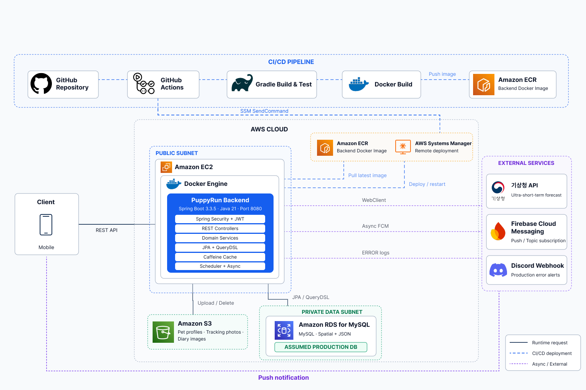
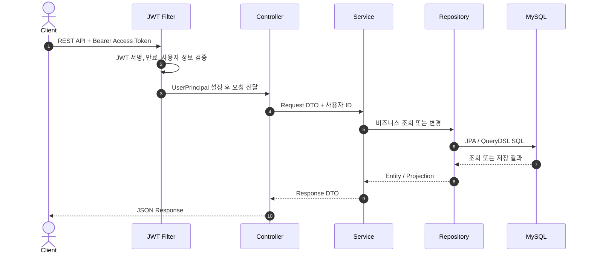
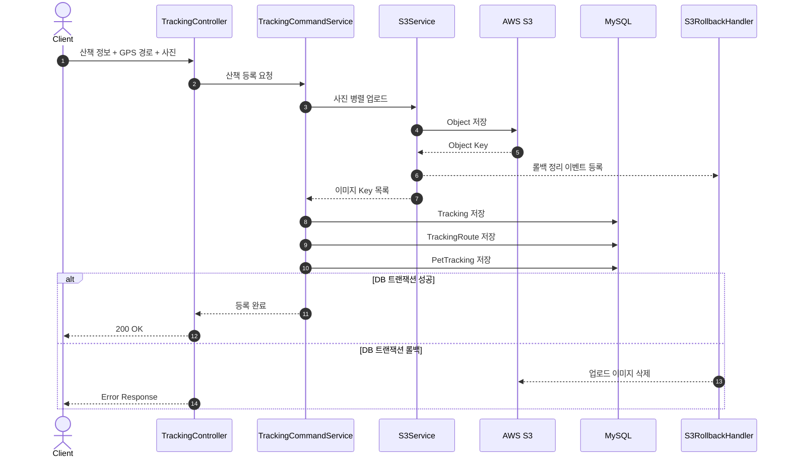
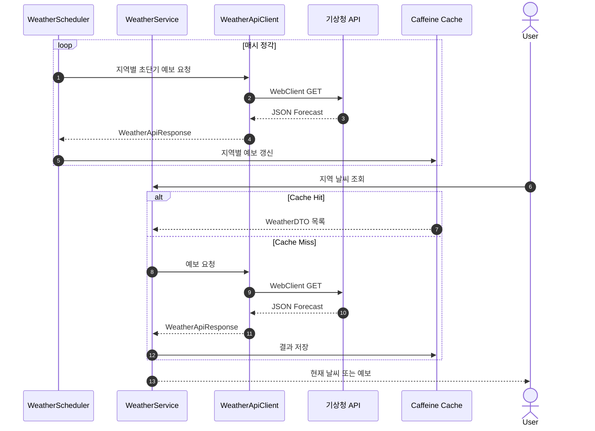
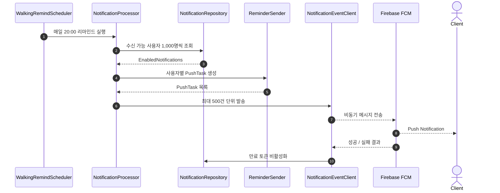
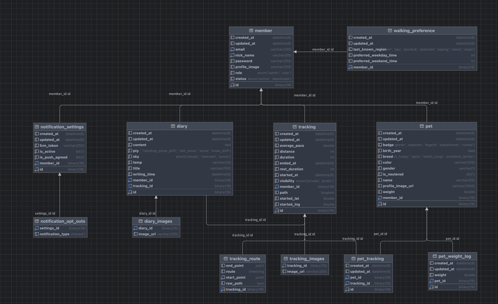

<div align="center">
  <h1>PuppyRun Backend</h1>
  
  <br>
  <h3>
    반려견과의 산책을 기록하고, 건강 변화와 활동 통계를 확인하며,<br>
    날씨와 생활 패턴에 맞는 산책 알림을 받을 수 있는
    <strong>반려견 산책 관리 서비스</strong>의 백엔드입니다.
  </h3>
  <h4>
    PuppyRun은 GPS 산책 경로, 거리, 시간, 페이스, 휴식 구간과 사진을 기록합니다.<br>
    기록된 데이터는 반려견별 활동 통계와 산책 일기로 연결되며,<br>
    최근 산책 지역과 시간대를 분석해 날씨 기반 맞춤형 푸시 알림을 제공합니다.
  </h4>
</div>

## 기술 스택

| 영역 | 기술 |
|---|---|
| Language | Java 21 |
| Framework | Spring Boot 3.3.5 |
| Security | Spring Security, JWT |
| Persistence | Spring Data JPA, QueryDSL 5, Hibernate Spatial |
| Database | MySQL, H2 for test |
| Cache | Spring Cache, Caffeine |
| Storage | AWS S3 |
| Push | Firebase Admin SDK, FCM |
| Async/Batch | Spring Async, Spring Scheduler, CompletableFuture |
| Build/Deploy | Gradle, Docker, Docker Compose |
| Logging | Logback, Discord Appender |


## 시스템 아키텍쳐



## 주요 데이터 흐름

### 1 인증된 API 요청



### 2 산책 기록 및 이미지 저장



### 3 날씨 조회 및 캐시 갱신



### 4 산책 리마인드 알림




## 패키지 구조

```text
org.zerock.puppyrun
├── PuppyRunApplication.java
├── auth
│   ├── controller
│   │   ├── request
│   │   └── response
│   ├── DTO
│   └── service
│       └── 회원가입, 로그인, JWT 발급,재발급
├── member
│   ├── controller
│   │   ├── request
│   │   └── response
│   ├── DTO
│   ├── entity
│   ├── exception
│   ├── repository
│   └── service
│       └── 계정 조회, 비밀번호,닉네임 변경
├── pet
│   ├── controller
│   │   ├── request
│   │   └── response
│   ├── DTO
│   ├── entity
│   ├── repository
│   └── service
│       └── 반려견 정보, 프로필, 몸무게 이력 관리
├── tracking
│   ├── controller
│   │   ├── request
│   │   └── response
│   ├── DTO
│   ├── entity
│   ├── repository
│   ├── service
│   └── util
│       └── 산책 기록, GPS 경로, 반려견 연결, 페이스 변환
├── diary
│   ├── controller
│   │   ├── request
│   │   └── response
│   ├── DTO
│   ├── entity
│   ├── repository
│   └── service
│       └── 산책 일기와 사진,날씨 정보 관리
├── statistics
│   ├── controller
│   │   └── Response
│   ├── DTO
│   └── service
│       └── 일간,주간,월간 및 반려견별 통계 집계
├── weather
│   ├── controller
│   │   └── response
│   ├── DTO
│   ├── exception
│   └── service
│       └── 기상청 API 호출, 응답 변환, 지역별 예보 조회
├── notification
│   ├── client
│   ├── controller
│   │   ├── request
│   │   └── response
│   ├── entity
│   ├── repository
│   ├── sender
│   └── service
│       └── 알림 설정, 산책 패턴 분석, FCM 발송
└── common
    ├── auth
    │   ├── jwt
    │   └── security
    ├── config
    ├── entity
    ├── exception
    ├── init
    ├── s3
    │   ├── rollback
    │   └── support
    └── scheduler
        └── 공통 설정, 인증, 예외 처리, 파일 저장, 배치 작업
```

### 패키지 설계 특징

| 구분 | 설명 |
|---|---|
| 도메인 중심 구성 | 인증, 회원, 반려견, 산책, 일기, 통계, 날씨, 알림을 기능 단위로 분리합니다. |
| 계층 분리 | 각 도메인에서 API, 비즈니스 로직, 영속성 책임을 `controller`, `service`, `repository`로 나눕니다. |
| Command/Query 분리 | 변경과 조회 흐름이 복잡한 `pet`, `tracking` 도메인은 Command와 Query 서비스를 분리합니다. |
| 공통 관심사 분리 | JWT, Security, S3, 캐시, 비동기 실행, 스케줄링, 전역 예외 처리를 `common`에서 관리합니다. |
| 통계 전용 조회 | 대량 집계와 기간별 통계는 QueryDSL 프로젝션으로 필요한 데이터만 조회합니다. |
| 공간 데이터 활용 | 산책 경로를 원본 JSON과 MySQL Spatial 데이터로 함께 저장합니다. |

##  ERD



- `Member`는 여러 반려견과 산책 기록, 일기를 소유합니다.
- `PetTracking`은 하나의 산책에 여러 반려견이 참여할 수 있도록 연결합니다.
- `TrackingRoute`는 산책 원본 좌표와 공간 검색용 경로를 함께 보관합니다.
- `Diary`는 산책과 연결되지만, 산책이 삭제된 뒤에도 독립적으로 유지될 수 있습니다.
- `WalkingPreference`는 최근 산책 위치와 평일,주말 선호 시간대를 저장합니다.
- `WalkingPreference`는 회원의 최근 산책 지역과 평일,주말 선호 산책 시간대를 저장하여, 개인화된 산책 추천과 알림 기능에 활용할 수 있도록 구성했습니다.
- `NotificationSettings`는 회원별 알림 설정 정보를 관리하며, FCM 토큰, 활성화 여부, 푸시 알림 동의 여부를 저장합니다.

- `NotificationOptOuts`는 알림 타입별 수신 거부 정보를 관리하여, 사용자가 특정 유형의 알림만 선택적으로 비활성화할 수 있도록 설계했습니다.
## 커밋 컨벤션

| 커밋 타입 | 설명 | 예시 커밋 메시지 |
|:---:|---|---|
| `Feat` | 새로운 기능 추가 | `Feat: 토큰 재발급 API 구현 (#15)` |
| `Fix` | 버그 수정 | `Fix: JWT 만료 예외 응답 수정` |
| `Refactor` | 기능 변경 없는 구조 개선 | `Refactor: 로그인 로직 메서드 분리` |
| `Test` | 테스트 코드 추가 및 개선 | `Test: 회원 조회 단위 테스트 추가` |
| `Docs` | 문서 수정 | `Docs: README 서비스 구조 추가` |
| `Chore` | 빌드 및 설정 변경 | `Chore: QueryDSL 의존성 추가` |
| `Infra` | 서버, Docker, CI/CD 변경 | `Infra: 배포용 Docker 설정 추가` |
| `Style` | 코드 포맷 및 오타 수정 | `Style: 코드 포맷 정리` |
| `Rename` | 파일 또는 디렉터리 이름 변경 | `Rename: MemberDto 이름 변경` |
| `Remove` | 사용하지 않는 코드 삭제 | `Remove: 미사용 로그 제거` |
